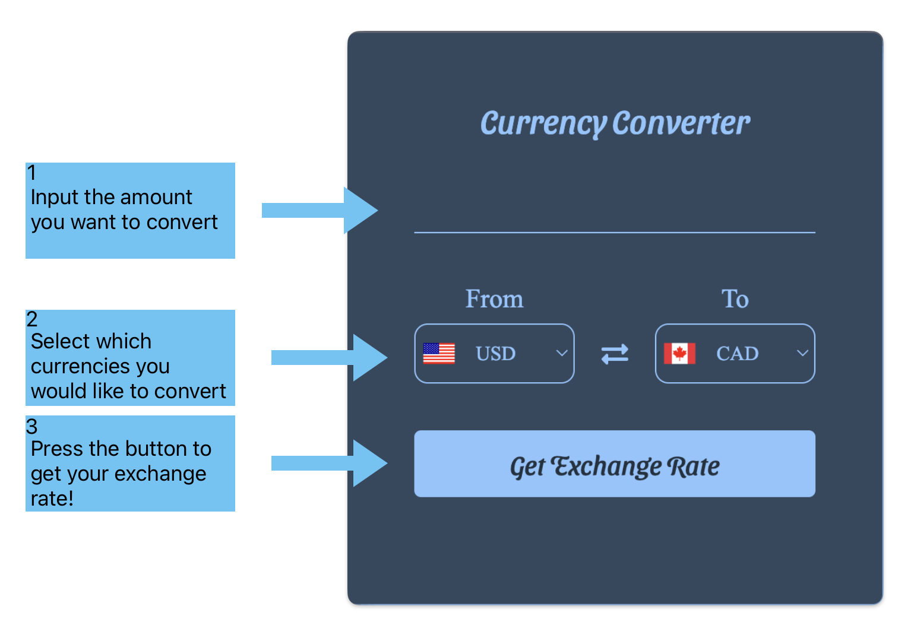
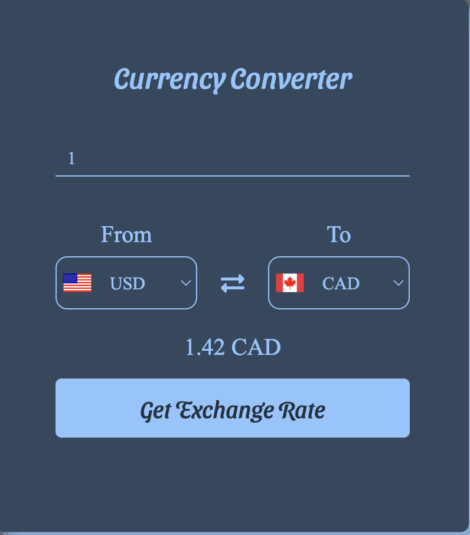

# Currency Converter


This is a simple currency converter that allows the user to convert between various currencies.\
It uses a currency exchange API to retrieve real-time exchange rates and displays the converted amount based on user input.
<br><br>
Currency exchange rates used from:
[ExchangeRate-API](https://app.exchangerate-api.com/)


## Problems and Planning

<h3>Problem Statement:</h3> 
I was watching Squid Games and I kept wondering how significant the money was in US Dollars

<h3>User Stories:</h3> 
As a user, I want to select my source and target currencies from dropdowns, so that I can convert from one currency to another.

As a user, I want to enter an amount in the source currency, so that I can see the converted amount in the target currency.

As a user, I want the app to support a wide range of currencies, so that I can convert between many different currencies.

As a user, I want the app to display flags for each currency, so that I can visually identify the currencies.

[Here is a link to the KanBan](https://kanbanflow.com/board/aC77YeP)

## Requirements

Currency Converter requires Node.js v22 or greater to run


To install Node.js you can use nvm:
```bash
  nvm install node
```
you can also install Node.js using a package manager like Homebrew:
```bash
  brew install node
```

## How to use



<h3>Your result should look like:</h3>



## Still not having fun?

try converting DOOM into DOOM 😈

    